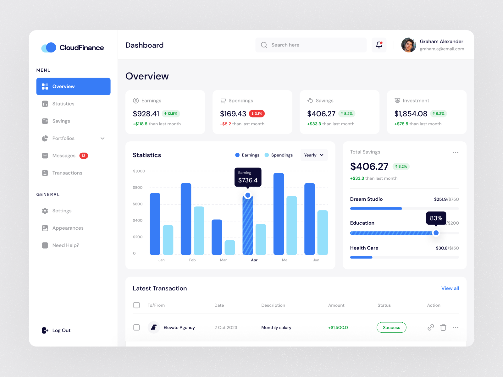

# Finance Management Dashboard UI

This repository contains Challenge One within the Flutter UI Challenges series. The UI design for this challenge is available on [Dribbble](https://dribbble.com/shots/22909091-Cloud-Finance-Financial-Management-Dashboard-UI) and was originally created by [Muhammad Izza Recka Putra](https://dribbble.com/Adhiari_ishttps://dribbble.com/muhammadizza) and it has been recreated in Flutter by [Mattias Nkonjo](https://github.com/mattias-nkonjo/) 

## Table of Contents

- [Overview](#overview)
- [Design](#design)
- [Support me](#supportme)
- [License](#license)

## Overview

The Challenge One project is dedicated to recreate the Finance Management Dashboard UI design using Flutter.

## Design

## Support me

- If you like the work please give me a star

## License

- The code in this repository is available under the MIT License.

